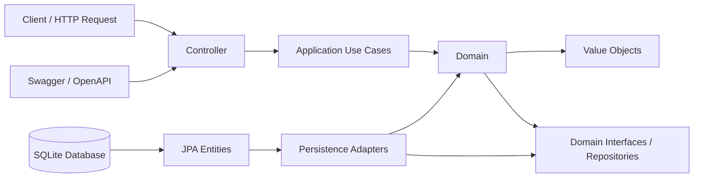

# Spring API

API REST em Java com Spring Boot para gerenciamento de alunos, avaliações físicas, exercícios e treinos. 
A aplicação foi estruturada em camadas utilizando Clean Architecture para separar domínio, casos de uso e infraestrutura de persistência e HTTP.

A API foi desenhada para controlar o processo de acompanhamento físico e treinamento de alunos em uma academia, oferecendo operações de cadastro, consulta, atualização e remoção de dados relacionados a pessoa, avaliação física e plano de exercícios.


## Visão geral

Esta aplicação centraliza o cadastro e consulta de:

- Alunos
- Avaliações físicas
- Exercícios
- Treinos vinculados a alunos

A estrutura segue uma abordagem de domínio rico com value objects, repositórios de domínio e uso de casos de uso (use cases) para orquestrar a lógica de negócio.

## Entidades principais

### Student
Representa o aluno da academia.

Atributos principais:
- id: identificador único do aluno
- name: nome
- email: e-mail do aluno
- phisicalAssessment: avaliação física associada
- workouts: treinos vinculados ao aluno

Regras de domínio:
- e-mail único
- pode possuir uma avaliação física por aluno
- pode possuir múltiplos treinos

### PhisicalAssessment
Representa a avaliação física do aluno.

Atributos principais:
- id
- preco: valor da avaliação
- altura
- percentBodyFat: percentual de gordura corporal

### Workout
Representa um treino de um aluno.

Atributos principais:
- id
- name: nome do treino
- objective: objetivo do treino
- exercises: conjunto de exercícios
- studentId: aluno responsável pelo treino

### Exercise
Representa cada exercício do treino.

Atributos principais:
- id
- name: nome do exercício
- grupoMuscular: grupo muscular trabalhado
- equipament: equipamento utilizado
- difficultLevel: nível de dificuldade

## Arquitetura do projeto

O projeto está organizado em pacotes com separação clara de responsabilidades:

- domain
  - entidades do núcleo da aplicação
  - value objects
  - interfaces de repositórios
  - exceções de domínio

- application
  - use cases
  - inputs/outputs de aplicação
  - regras de negócios aplicáveis a cada operação

- infrastructure
  - controllers REST
  - handlers de exceção HTTP
  - persistência JPA
  - mapeamento de entidades do banco para o domínio

### Fluxo de arquitetura

1. Controller recebe a requisição HTTP.
2. Caso de uso executa a lógica de negócio.
3. Repositório persiste ou consulta dados no banco.
4. Entidade JPA converte para domínio e vice-versa.
5. Resposta é retornada em DTOs específicos para a API.

## Mapa de dependências

A arquitetura segue uma abordagem de Clean Architecture, com dependência fluindo das camadas externas para o núcleo do domínio.



## Persistência

A aplicação usa JPA com SQLite.

Configuração principal em `src/main/resources/application.yaml`:

- URL do banco: `jdbc:sqlite:meubanco.db?foreign_keys=on`
- driver: `org.sqlite.JDBC`
- Hibernate: `ddl-auto: update`
- dialeto: `org.hibernate.community.dialect.SQLiteDialect`

O arquivo de banco SQLite local é `meubanco.db` na raiz do projeto.

## Stack tecnológica

- Java: 21
- Spring Boot: 4.0.7
- Maven
- Spring Web MVC
- Spring Data JPA
- Hibernate ORM
- SQLite JDBC
- Springdoc OpenAPI (Swagger UI)
- Lombok


## Endpoints principais

### Alunos
- `POST /v1/student` - cria um aluno
- `GET /v1/student` - lista alunos
- `GET /v1/student/{id}` - busca aluno por ID
- `DELETE /v1/student/{id}` - remove aluno
- `GET /v1/student/{id}/assessment` - busca avaliação física do aluno
- `POST /v1/student/{id}/assessment` - cria avaliação física
- `GET /v1/student/{id}/workout` - lista treinos do aluno
- `POST /v1/student/{id}/workout` - cria treino para o aluno

### Exercícios
- `GET /v1/exercise` - lista exercícios
- `POST /v1/exercise` - cria exercício
- `GET /v1/exercise/{id}` - busca exercício por ID
- `PATCH /v1/exercise/{id}` - atualiza exercício
- `DELETE /v1/exercise/{id}` - remove exercício

### Treinos
- `POST /v1/workout` - cria treino (com aluno informado por query param)
- `GET /v1/workout/detail` - busca detalhes paginados de treinos
- `DELETE /v1/workout/{id}` - remove treino

## Documentação da API

A aplicação inclui suporte a OpenAPI/Swagger via `springdoc-openapi-starter-webmvc-ui`.

A documentação pode ser acessada em:

- `http://localhost:8080/swagger-ui/index.html`

## Como executar

1. Certifique-se de ter Java 21 instalado.
2. Na raiz do projeto, execute:

```bash
./mvnw spring-boot:run
```

Ou no Windows:

```bash
mvnw.cmd spring-boot:run
```

3. A aplicação iniciará no padrão Spring Boot em:

```text
http://localhost:8080
```

## Observações

- O banco é gerado/atualizado automaticamente pelo Hibernate.
- A estrutura do projeto favorece manutenção e evolução futuras com regras de negócio encapsuladas em casos de uso.
- O projeto está em uma arquitetura orientada a entidades de domínio e operações de aplicação, adequada para APIs REST de negócio.

## Estrutura resumida

```text
springAPI/
├── src/
│   ├── main/
│   │   ├── java/
│   │   │   └── br/com/alex/springAPI/
│   │   │       ├── domain/
│   │   │       ├── application/
│   │   │       ├── infrastructure/
│   │   │       └── SpringApiApplication.java
│   │   └── resources/
│   │       └── application.yaml
│   └── test/
├── pom.xml
├── mvnw
├── mvnw.cmd
├── meubanco.db
└── README.md
```
