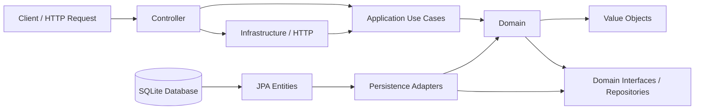

# Spring API

API REST em Java com Spring Boot para gerenciamento de alunos, avaliações físicas, exercícios e treinos. 
A aplicação foi estruturada em camadas utilizando Clean Architecture para separar domínio, casos de uso e infraestrutura de persistência e HTTP.

A API foi desenhada para controlar o processo de acompanhamento físico e treinamento de alunos em uma academia, oferecendo operações de cadastro, consulta, atualização e remoção de dados relacionados a pessoa, avaliação física e plano de exercícios.


## Visão geral

Esta aplicação centraliza o cadastro e consulta de:

- Alunos
- Avaliações físicas
- Exercícios
- Treinos vinculados a alunos

A estrutura segue uma abordagem de domínio rico com value objects, repositórios de domínio e uso de casos de uso (use cases) para orquestrar a lógica de negócio.

## Entidades principais

### Student
Representa o aluno da academia.

| Campo | Descrição |
| --- | --- |
| `id` | Identificador único do aluno. |
| `name` | Nome completo do aluno. |
| `email` | E-mail do aluno, utilizado como identificador único. |
| `phisicalAssessment` | Avaliação física associada ao aluno. |
| `workouts` | Treinos vinculados ao aluno. |

Regras de domínio:
- e-mail único
- pode possuir uma avaliação física por aluno
- pode possuir múltiplos treinos

### PhisicalAssessment
Representa a avaliação física do aluno.

| Campo | Descrição |
| --- | --- |
| `id` | Identificador único da avaliação. |
| `preco` | Valor da avaliação física. |
| `altura` | Altura do aluno em centímetros ou unidade configurada. |
| `percentBodyFat` | Percentual de gordura corporal. |

### Workout
Representa um treino de um aluno.

| Campo | Descrição |
| --- | --- |
| `id` | Identificador único do treino. |
| `name` | Nome do treino. |
| `objective` | Objetivo principal do treino. |
| `exercises` | Conjunto de exercícios pertencentes ao treino. |
| `studentId` | Identificador do aluno ao qual o treino pertence. |

### Exercise
Representa cada exercício do treino.

| Campo | Descrição |
| --- | --- |
| `id` | Identificador único do exercício. |
| `name` | Nome do exercício. |
| `grupoMuscular` | Grupo muscular trabalhado. |
| `equipament` | Equipamento necessário para executar o exercício. |
| `difficultLevel` | Nível de dificuldade do exercício. |

## Arquitetura do projeto

O projeto está organizado em pacotes com separação clara de responsabilidades:

- domain
  - entidades do núcleo da aplicação
  - value objects
  - interfaces de repositórios
  - exceções de domínio

- application
  - use cases
  - inputs/outputs de aplicação
  - regras de negócios aplicáveis a cada operação

- infrastructure
  - controllers REST
  - handlers de exceção HTTP
  - persistência JPA
  - mapeamento de entidades do banco para o domínio

### Fluxo de arquitetura

1. Controller recebe a requisição HTTP.
2. Caso de uso executa a lógica de negócio.
3. Repositório persiste ou consulta dados no banco.
4. Entidade JPA converte para domínio e vice-versa.
5. Resposta é retornada em DTOs específicos para a API.

## Mapa de dependências

A arquitetura segue uma abordagem de Clean Architecture, com dependência fluindo das camadas externas para o núcleo do domínio.



## Persistência

A aplicação usa JPA com SQLite.

Configuração principal em `src/main/resources/application.yaml`:

- URL do banco: `jdbc:sqlite:meubanco.db?foreign_keys=on`
- driver: `org.sqlite.JDBC`
- Hibernate: `ddl-auto: update`
- dialeto: `org.hibernate.community.dialect.SQLiteDialect`

O arquivo de banco SQLite local é `meubanco.db` na raiz do projeto.

## Stack tecnológica

- Java: 21
- Spring Boot: 4.0.7
- Maven
- Spring Web MVC
- Spring Data JPA
- Hibernate ORM
- SQLite JDBC
- Springdoc OpenAPI (Swagger UI)
- Lombok


## Endpoints principais

A API foi reorganizada para uso com paginação explícita e parâmetros de consulta adicionais, com foco em organização e escalabilidade.

### Alunos

| Endpoint | Descrição |
| --- | --- |
| `POST /v1/student` | Cria um novo aluno. |
| `GET /v1/student/page/{page}/size/{size}` | Lista alunos paginados. Query opcional: `include=assessment` para incluir dados da avaliação. |
| `GET /v1/student/{id}` | Busca um aluno por ID. Query opcional: `include=assessment`. |
| `DELETE /v1/student/{id}` | Remove um aluno. |
| `GET /v1/student/{id}/assessment` | Retorna a avaliação física do aluno. |
| `POST /v1/student/{id}/assessment` | Cria uma avaliação física para o aluno. |
| `POST /v1/student/{id}/workout` | Cria um treino para o aluno. |
| `GET /v1/student/{id}/workout?page={page}&size={size}` | Lista treinos do aluno. Query opcional: `include=exercises` para incluir exercícios. |

### Exercícios

| Endpoint | Descrição |
| --- | --- |
| `GET /v1/exercise/page/{page}/size/{size}` | Lista exercícios paginados. |
| `POST /v1/exercise` | Cria um exercício. |
| `GET /v1/exercise/{id}` | Busca um exercício por ID. |
| `PATCH /v1/exercise/{id}` | Atualiza parcialmente um exercício. |
| `DELETE /v1/exercise/{id}` | Remove um exercício. |

### Treinos

| Endpoint | Descrição |
| --- | --- |
| `POST /v1/workout?studentid={uuid}` | Cria um treino vinculando um aluno por query param. |
| `GET /v1/workout/page/{page}/size/{size}` | Lista treinos paginados. Query opcional: `query={termo}` para filtro por texto. |
| `GET /v1/workout/detail?page={page}&size={size}` | Retorna detalhes paginados dos treinos. |
| `DELETE /v1/workout/{id}` | Remove um treino. |

### Observações sobre paginação
- A paginação passou a ser explícita em rotas como `/page/{page}/size/{size}`.
- Em alguns casos, a paginação é controlada por parâmetros `page` e `size` em query string.
- Parâmetros opcionais como `include` e `query` permitem adaptar a resposta conforme a necessidade da requisição.

## Documentação da API

A aplicação inclui suporte a OpenAPI/Swagger via `springdoc-openapi-starter-webmvc-ui`.

A documentação pode ser acessada em:

- `http://localhost:8080/swagger-ui/index.html`

## Como executar

1. Certifique-se de ter Java 21 instalado.
2. Na raiz do projeto, execute:

```bash
./mvnw spring-boot:run
```

Ou no Windows:

```bash
mvnw.cmd spring-boot:run
```

3. A aplicação iniciará no padrão Spring Boot em:

```text
http://localhost:8080
```

## Observações

- O banco é gerado/atualizado automaticamente pelo Hibernate.
- A estrutura do projeto favorece manutenção e evolução futuras com regras de negócio encapsuladas em casos de uso.
- O projeto está em uma arquitetura orientada a entidades de domínio e operações de aplicação, adequada para APIs REST de negócio.

## Estrutura resumida

```text
springAPI/
├── src/
│   ├── main/
│   │   ├── java/
│   │   │   └── br/com/alex/springAPI/
│   │   │       ├── domain/
│   │   │       ├── application/
│   │   │       ├── infrastructure/
│   │   │       └── SpringApiApplication.java
│   │   └── resources/
│   │       └── application.yaml
│   └── test/
├── pom.xml
├── mvnw
├── mvnw.cmd
├── meubanco.db
└── README.md
```
